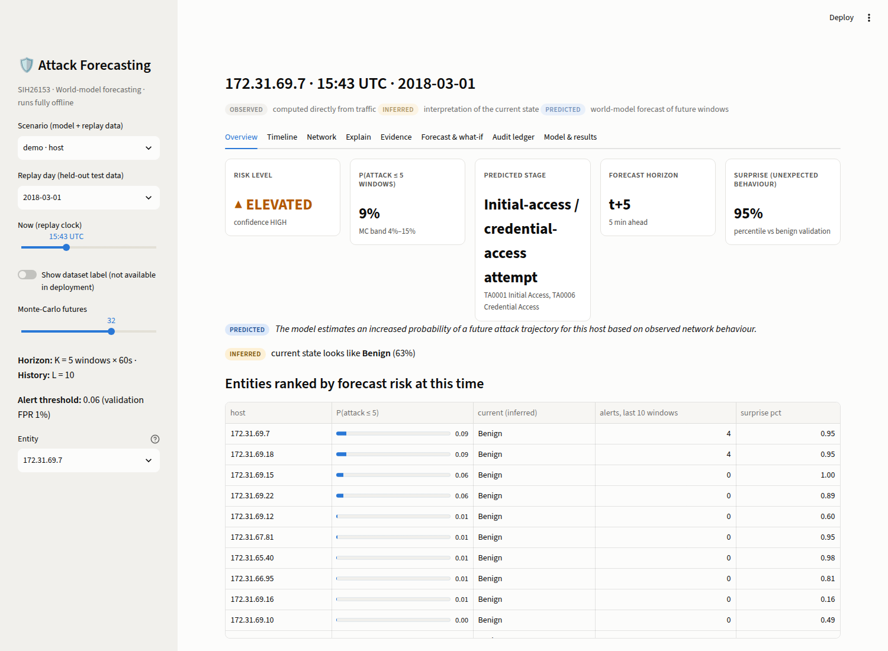

# SIH26153 · AI-Based Network Attack Forecasting with a World Model

Smart India Hackathon 2026 · Theme: Blockchain & Cybersecurity · Category: Software

A **world model** of network behaviour: it learns how the traffic state of every host (or of the
whole network) evolves from one minute to the next, **P(S<sub>t+1</sub> | S<sub>≤t</sub>)**,
simulates the next K minutes, and estimates the probability that the trajectory is heading into
an attack stage (mapped to MITRE ATT&CK v19.2), with an explanation an analyst can check. It is
trained and evaluated on the real CSE-CIC-IDS2018 data, compared against logistic-regression and
XGBoost baselines, and runs fully offline (Streamlit dashboard, CLI, optional tamper-evident ledger).

> **Honest summary of the results** (details in [`reports/`](reports)): on held-out test days,
> forecasting *continuation* of an attack works well, but **no model – ours or the baselines –
> reliably forecasts attack onsets before they start** in this dataset. The world model beats the
> current-window baselines on some settings and loses on others; XGBoost on lagged features is a
> strong competitor. A synthetic sanity check shows the model *does* exploit precursors when they
> exist. See [Results](#results) – no number in this repository is invented.

---

## Contents
1. [What it does](#what-it-does) · 2. [Architecture](#architecture) · 3. [Quick start (demo, no data)](#quick-start)
4. [Full reproduction](#full-reproduction) · 5. [Results](#results) · 6. [Repository layout](#repository-layout)
7. [Limitations & responsible use](#limitations--responsible-use) · 8. [Documents](#documents)

## What it does

For every entity (internal host, or the network as a whole) and every 60-second window it outputs:

| Output | Example field (`predict.py` JSON) |
|---|---|
| Infiltration probability within the horizon (calibrated) + Monte-Carlo band | `predicted.p_attack_within_K`, `band_5_95` |
| Forecast horizon (first future window where the cumulative probability crosses the alert threshold) | `predicted.first_crossing_step` |
| Predicted future attack stage + ATT&CK tactic(s) | `predicted.most_likely_future_stage`, `attack_tactics` |
| Per-step stage probabilities t+1 … t+K | `predicted.stage_probs` |
| Confidence / risk level | `predicted.confidence`, `risk_level` |
| Important contributing features, as sentences with real values | `explanation.evidence` |
| Relevant flows / hosts | `observed.top_flows` |
| Current state interpretation + candidate ATT&CK techniques | `inferred.*` |
| Surprise score (behaviour the dynamics did not expect) | `predicted.surprise_percentile` |

Every record separates **OBSERVED** (facts from traffic), **INFERRED** (interpretation of the
current state) and **PREDICTED** (future windows, with probability). The wording is always
*"the model estimates an increased probability of a future attack trajectory"* – never *"an attack
will happen"*.

## Architecture

```text
CICFlowMeter CSV ─┐                          ┌─► labels (dataset label → stage; kept separate)
raw PCAP (dpkt) ──┴─► canonical flows ───────┤
                                             └─► 60 s windows × entity: flow + packet + graph +
                                                 causal-temporal + global features (67 host / 38 network)
                                                 → robust scaling (benign TRAIN windows only)
S_t ─► Encoder ─► GRUCell ─► h_t ─┬─► dynamics head  N(μ, σ²) = P(S_{t+1} | h_t)
                                  └─► stage head     P(stage)
Rollout: Ŝ_{t+1} ~ N(μ,σ²) → GRUCell → h_{t+1} → stage head → … (K = 5 steps, 32 Monte-Carlo futures)
P(attack within K) = 1 − Π_k P(benign at t+k)  → isotonic calibration → alert threshold (val FPR 1 %)
→ Integrated Gradients explanation → ATT&CK mapping → dashboard / CLI → evidence ledger (optional)
```

Why a GRU and not a Transformer/Temporal GNN: tens of attack episodes (not thousands), short
sequences, native step-by-step rollout, CPU-trainable (~0.12 M parameters), and graph information
is supplied as cheap per-host features (new peers, fan-out, neighbours' fan-out). Full design
rationale: [`docs/BLUEPRINT.md`](docs/BLUEPRINT.md) · two-page summary: [`docs/ARCHITECTURE.md`](docs/ARCHITECTURE.md).

## Quick start

The repository ships trained models and small replay slices of the held-out test days in
[`demo/`](demo), so the dashboard works right after cloning – no dataset download, no training.

```bash
python -m venv .venv && source .venv/bin/activate          # Windows: .venv\Scripts\activate
pip install torch --index-url https://download.pytorch.org/whl/cpu
pip install -r requirements.txt
streamlit run app.py                                         # http://localhost:8501, fully offline
```

Dashboard tabs: **Overview** (risk, probability, predicted stage, horizon, ranked hosts) ·
**Timeline** (past forecasts, now, next K windows, optional dataset-label overlay, stage progression) ·
**Network** (communication graph of the selected host) · **Explain** (evidence sentences + IG
heatmap) · **Evidence** (candidate ATT&CK techniques, top flows, feature trends) · **Forecast &
what-if** (per-step stage probabilities; clamp features of the imagined future and re-simulate) ·
**Audit ledger** (record, verify, tamper demo) · **Model & results**.

CLI inference on your own data (CICFlowMeter CSV, canonical CSV/parquet or PCAP):

```bash
python predict.py --artifact demo/network/artifact --flows data/sample/cic2018_2018-03-01_1320-1510_flows.parquet --out forecast.json
python predict.py --artifact demo/host/artifact --pcap capture.pcap --top 5 --ledger artifacts/ledger.sqlite
python scripts/verify_ledger.py artifacts/ledger.sqlite
```

## Full reproduction

Needs ~15 GB RAM, ~25 GB disk, 4 CPU cores; no GPU. Internet only for the one-time download.

```bash
pip install -r requirements.txt -r requirements-optional.txt
bash scripts/download_cic2018.sh                           # 6.4 GB processed CSVs (public S3)
python scripts/extract_cic2018_pcaps.py --day Thursday-01-03-2018     # streams 63 GB, keeps ~0.4 GB of flows
python scripts/extract_cic2018_pcaps.py --day Wednesday-28-02-2018    # streams 53 GB
python notebooks/01_eda_label_timeline.py                  # optional: see the data problems we fix
PY=python bash scripts/run_all.sh                          # preprocess → train → ablations → reports
pytest -q                                                  # 33 tests (+1 slow dashboard test: RUN_SLOW=1)
```

Individual steps: `scripts/preprocess.py --config …`, `train.py --config … [--protocol B] [--set key=value]`,
`scripts/evaluate.py --config …`, `scripts/make_demo_bundle.py`. Configs: [`configs/`](configs).

**Data problems found and fixed** ([`docs/DATA_NOTES.md`](docs/DATA_NOTES.md)): 12-hour clock
without AM/PM, local time UTC−4, repeated header rows, 1970 rows, exact duplicates, 67,973
contradictory duplicate rows labelled both benign and attack (28-02), two days whose benign
background is missing (excluded), and no IP columns in 9 of 10 CSVs (→ host-level data rebuilt from
the raw PCAPs with labels transferred by victim identification).

## Results

<!-- RESULTS:START -->
**Host level – infiltration, raw PCAPs (train 28-02 → test 01-03), 433 hosts, 67 features** – test windows: 231,510 (positives 710); onsets for early warning: 45

| Model | PR-AUC [95% CI] | PR-AUC onset | F1 | FPR | Recall T−1 | Recall T−2 |
|---|---|---|---|---|---|---|
| World model | 0.142 [0.05, 0.26] | 0.010 | 0.131 | 0.0112 | 0.09 | 0.13 |
| XGBoost (lagged history) | 0.145 [0.06, 0.25] | 0.028 | 0.261 | 0.0030 | 0.16 | 0.13 |
| LogReg (lagged history) | 0.070 [0.03, 0.12] | 0.021 | 0.073 | 0.0002 | 0.00 | 0.07 |
| LogReg (current window) | 0.145 [0.06, 0.24] | 0.014 | 0.210 | 0.0019 | 0.09 | 0.13 |
| Persistence (oracle current label) | 0.359 [0.21, 0.50] | 0.001 | 0.560 | 0.0002 | 0.00 | 0.00 |

World-model PR-AUC across seeds: 0.156 ± 0.024 (n=3 seeds).

**Network level – 8 CSV days, Protocol A (per-family chronological)** – test windows: 1,848 (positives 552); onsets for early warning: 6

| Model | PR-AUC [95% CI] | PR-AUC onset | F1 | FPR | Recall T−1 | Recall T−2 |
|---|---|---|---|---|---|---|
| World model | 0.610 [0.33, 0.80] | 0.026 | 0.558 | 0.0108 | 0.00 | 0.00 |
| XGBoost (lagged history) | 0.683 [0.43, 0.84] | 0.026 | 0.545 | 0.0046 | 0.00 | 0.00 |
| LogReg (lagged history) | 0.350 [0.19, 0.54] | 0.028 | 0.415 | 0.3519 | 0.33 | 0.33 |
| LogReg (current window) | 0.317 [0.17, 0.51] | 0.025 | 0.224 | 0.3511 | 0.33 | 0.33 |
| Persistence (oracle current label) | 0.911 [0.81, 0.97] | 0.028 | 0.936 | 0.0054 | 0.00 | 0.00 |

World-model PR-AUC across seeds: 0.532 ± 0.101 (n=3 seeds).

Protocol B (strict global chronology, attack families unseen in training): world model PR-AUC 0.449, XGBoost 0.604, LogReg (current) 0.420.

**What the numbers say**

- *Continuation vs onset.* Inside an ongoing attack every model scores high (network PR-AUC on ongoing windows ≈ 0.99), but the base rate there is already very high – continuation is easy. On currently-benign windows (onset) PR-AUC stays near the base rate for every model: no reliable pre-onset warning on this data.
- *World model vs baselines.* The world model is on par with the current-window logistic regression and XGBoost at host level and below XGBoost at network level; seed-to-seed spread is large, and ablation differences within that spread are not meaningful.
- *Dynamics.* Removing the dynamics loss (A1) gives PR-AUC 0.625 (network) / 0.122 (host) vs 0.610 / 0.142: the learned dynamics do not measurably help the attack forecast here. The mean next-state prediction is better than persistence on validation days but not on the test days (network MSE k=1: 0.365 vs 0.315) – a day-to-day distribution shift.
- *Calibration and explanations work.* Host-level ECE ≈ 0.001; the IG deletion test shows the attributed features drive the forecast (see reports).
- *Synthetic sanity check* (`tests/test_model.py::test_toy_world…`): when a 3-window precursor trend exists, the world model reaches onset PR-AUC ≈ 0.50 vs 0.10 for a current-window classifier (chance 0.09) over 3 seeds – the model can exploit precursors when the data contains them.

Full tables, confidence intervals, ablations and figures: [`reports/cic2018_host/RESULTS.md`](reports/cic2018_host/RESULTS.md), [`reports/cic2018_network/RESULTS.md`](reports/cic2018_network/RESULTS.md).


<!-- RESULTS:END -->

## Repository layout

```text
netwm/                 the Python package
  io/                  canonical schema, CICFlowMeter loader, PCAP → flows (dpkt), remote-ZIP reader
  labels/              label → stage mapping (YAML), window stages, CSV → PCAP label transfer
  features/            windowing (host/network), packet block, causal temporal block, scaler
  data/                preparation, leakage-free splits, sequence datasets
  models/              world model (GRU/LSTM, recursive/direct), baselines (persistence, LogReg, XGBoost)
  training/            losses, training loop (scheduled sampling), calibration
  forecasting/         Monte-Carlo rollout, what-if interventions, risk summary
  attack_mapping/      ATT&CK v19.2 subset, indicator rules, observed/inferred/predicted record
  explain/             Integrated Gradients, evidence sentences, deletion (faithfulness) test
  evaluation/          metrics, early-warning lead time, block bootstrap, plots
  ledger/              hash chain + Ed25519, Merkle roots, optional EVM anchoring (Solidity)
  inference/           end-to-end offline pipeline used by predict.py and the dashboard
  experiment.py        one experiment: models + baselines + calibration + metrics + artifacts
configs/               default.yaml, cic2018_network.yaml, cic2018_host.yaml
scripts/               download, PCAP extraction, preprocess, evaluate, ablations, demo bundle, ledger
dashboard/, app.py     Streamlit dashboard          train.py, predict.py   CLIs
demo/                  trained models + replay slices (committed)   reports/   results + figures
docs/                  BLUEPRINT, ARCHITECTURE (2 pages), DATA_NOTES, LABEL_MAPPING, SLIDES
tests/                 pytest suite
```

## Limitations & responsible use

- **Onset forecasting is not demonstrated on real data.** CIC-IDS2018 attacks are scripted,
  mostly start abruptly and occur once or twice per family; there are few pre-attack precursors
  to learn from. Treat the probabilities as decision support, not as predictions of intent.
- **Labels are coarse.** The dataset labels by (attacker/victim IP, time); host-level labels are
  transferred from CSVs without IPs (documented procedure, reported statistics).
- **Unsupported stages.** Lateral movement and exfiltration have no ground truth in the data; the
  system reports them as unsupported instead of guessing.
- **Distribution shift.** Thresholds chosen on validation days transfer imperfectly to new days;
  recalibrate on local benign traffic before deployment. The surprise score helps flag novelty.
- **Encrypted/adversarial traffic.** Only metadata is used (works on TLS), but a patient attacker
  can mimic benign timing and volume.
- **Dataset bias.** Synthetic benign traffic, few attacker machines; IP addresses, ports and
  time-of-day are deliberately not model inputs to avoid shortcuts.
- **Privacy.** The ledger stores hashes and model outputs, never raw traffic.

## Documents

[`docs/BLUEPRINT.md`](docs/BLUEPRINT.md) (full design) · [`docs/ARCHITECTURE.md`](docs/ARCHITECTURE.md) (2 pages) ·
[`docs/DATA_NOTES.md`](docs/DATA_NOTES.md) · [`docs/LABEL_MAPPING.md`](docs/LABEL_MAPPING.md) ·
[`docs/SLIDES.md`](docs/SLIDES.md) (5-slide deck + 2-minute demo script) ·
[`docs/problem_statement_SIH26153.md`](docs/problem_statement_SIH26153.md)
