# Results – cic2018_host (Protocol A)

Generated by `scripts/evaluate.py` from `artifacts/cic2018_host/main`. All numbers are on the held-out **test** split; thresholds were chosen on validation (FPR 1% on quiet validation windows).

Test samples: 231510 (positives: 710); train 2904, val 39836.

## Horizon forecast: P(attack within K windows)

| Model | Precision | Recall | F1 | FPR | ROC-AUC | PR-AUC (95% CI) | PR-AUC onset (95% CI) | PR-AUC ongoing | Brier | ECE |
|---|---|---|---|---|---|---|---|---|---|---|
| World model | 0.082 | 0.324 | 0.131 | 0.0112 | 0.923 | 0.142 [0.05, 0.26] | 0.010 [0.00, 0.02] | 0.918 | 0.003 | 0.001 |
| XGBoost (lagged) | 0.233 | 0.297 | 0.261 | 0.0030 | 0.921 | 0.145 [0.06, 0.25] | 0.028 [0.01, 0.05] | 0.923 | 0.003 | 0.001 |
| LogReg (lagged) | 0.337 | 0.041 | 0.073 | 0.0002 | 0.907 | 0.070 [0.03, 0.12] | 0.021 [0.01, 0.04] | 0.917 | 0.003 | 0.001 |
| LogReg (current window) | 0.232 | 0.192 | 0.210 | 0.0019 | 0.906 | 0.145 [0.06, 0.24] | 0.014 [0.01, 0.02] | 0.919 | 0.003 | 0.001 |
| Persistence (oracle label) | 0.860 | 0.415 | 0.560 | 0.0002 | 0.708 | 0.359 [0.21, 0.50] | 0.001 [0.00, 0.00] | 0.860 | 0.002 | 0.002 |

*Persistence uses the TRUE current label (an oracle detector) – it is a reference, not a deployable model.* *Onset = windows whose own label is benign; ongoing = windows already inside an attack.*

World model over 3 seeds: PR-AUC 0.156 ± 0.024, onset PR-AUC 0.011 ± 0.003, F1 0.166 ± 0.038, FPR 0.007 ± 0.003. Differences between ablations smaller than this seed spread are not meaningful.

## Early warning (recall at the validation threshold)

| Model | lead 0 (onset window) | T−1 | T−2 | T−3 | # onsets |
|---|---|---|---|---|---|
| World model | 0.22 | 0.09 | 0.13 | 0.11 | 45 |
| XGBoost (lagged) | 0.16 | 0.16 | 0.13 | 0.13 | 45 |
| LogReg (lagged) | 0.04 | 0.00 | 0.07 | 0.02 | 45 |
| LogReg (current window) | 0.22 | 0.09 | 0.13 | 0.02 | 45 |
| Persistence (oracle label) | 1.00 | 0.00 | 0.00 | 0.00 | 45 |

## Next-state forecasting (does the model learn dynamics?)

| step k | 1 | 2 | 3 | 4 | 5 |
|---|---|---|---|---|---|
| World model MSE | 0.723 | 0.736 | 0.748 | 0.760 | 0.771 |
| Persistence MSE | 0.661 | 0.592 | 0.672 | 0.648 | 0.713 |

## Future-stage macro-F1 per step (world model)

k=1: 0.353 | k=2: 0.338 | k=3: 0.334 | k=4: 0.334 | k=5: 0.337

## Explainability sanity check (deletion test)

Replacing the top-5 IG features by benign values lowers P(attack) by 0.998 on average vs 0.000 for 5 random features (n=40 highest-risk test forecasts).

## Ablations (world model only)

| Run | What changed | PR-AUC | PR-AUC onset | F1 | FPR | recall T−1 | recall T−2 | state MSE k=1 / k=5 |
|---|---|---|---|---|---|---|---|---|
| A1_no_dynamics_loss | dynamics loss weight 0 (a sequence classifier) | 0.122 | 0.010 | 0.131 | 0.0044 | 0.07 | 0.09 | 0.916 / 0.949 |
| A2_direct_heads | K direct heads on h_t instead of recursive rollout | 0.152 | 0.010 | 0.171 | 0.0072 | 0.09 | 0.11 | 0.641 / 0.672 |
| A3_L1 | history length 1 (no temporal context) | 0.136 | 0.007 | 0.179 | 0.0045 | 0.04 | 0.09 | 0.807 / 0.899 |
| A3_L20 | history length 20 | 0.062 | 0.009 | 0.074 | 0.0096 | 0.00 | 0.00 | 0.676 / 0.719 |
| A3_L5 | history length 5 | 0.094 | 0.012 | 0.151 | 0.0060 | 0.09 | 0.09 | 0.738 / 0.782 |
| A6_teacher_forcing_only | always teacher forcing (no scheduled sampling) | 0.241 | 0.018 | 0.285 | 0.0037 | 0.09 | 0.11 | 0.709 / 0.800 |
| A7_lstm | LSTM cell instead of GRU | 0.157 | 0.013 | 0.209 | 0.0019 | 0.07 | 0.02 | 0.749 / 0.789 |
| main | selected configuration (hidden 64, benign ratio 5) + baselines | 0.142 | 0.010 | 0.131 | 0.0112 | 0.09 | 0.13 | 0.723 / 0.771 |
| residual | residual dynamics (predict change of state) | 0.158 | 0.010 | 0.172 | 0.0050 | 0.09 | 0.09 | 0.656 / 0.726 |
| seed1 | same as main, seed 1 | 0.137 | 0.009 | 0.148 | 0.0058 | 0.09 | 0.04 | 0.752 / 0.795 |
| seed2 | same as main, seed 2 | 0.190 | 0.016 | 0.219 | 0.0048 | 0.09 | 0.11 | 0.686 / 0.730 |
| sel_br20 | selection run: benign ratio 20, hidden 128 | 0.116 | 0.004 | 0.179 | 0.0001 | 0.00 | 0.00 | 0.765 / 0.811 |
| sel_br20_h64 | selection run: benign ratio 20, hidden 64 | 0.060 | 0.013 | 0.145 | 0.0042 | 0.11 | 0.09 | 0.544 / 0.575 |
| sel_br5 | selection run: benign ratio 5, hidden 128 | 0.112 | 0.009 | 0.142 | 0.0104 | 0.09 | 0.11 | 0.634 / 0.681 |
| sel_br50 | selection run: benign ratio 50, hidden 128 | 0.120 | 0.005 | 0.187 | 0.0002 | 0.00 | 0.00 | 0.653 / 0.728 |
| sel_br5_h64 | selection run: benign ratio 5, hidden 64 (selected on validation) | 0.142 | 0.010 | 0.131 | 0.0112 | 0.09 | 0.13 | 0.723 / 0.771 |

## Figures

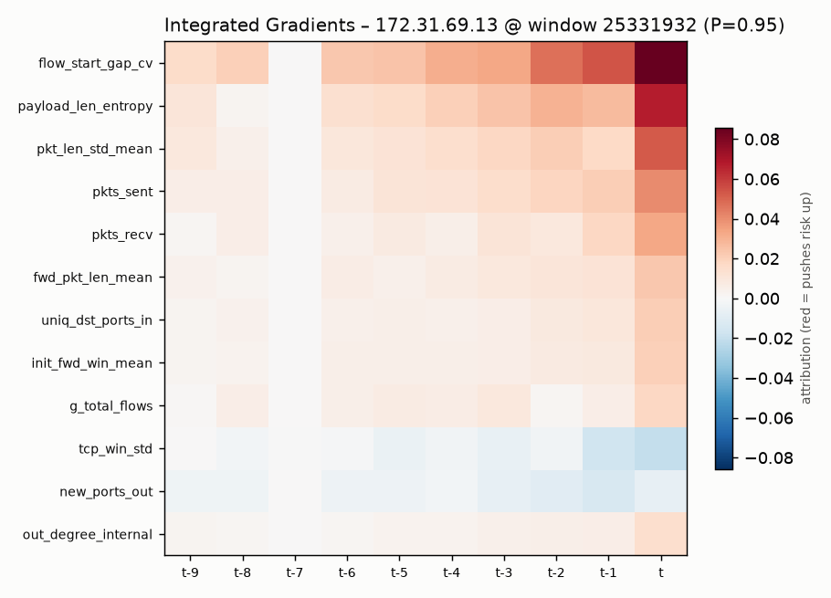
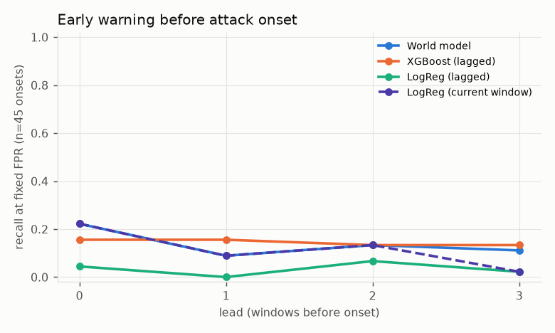
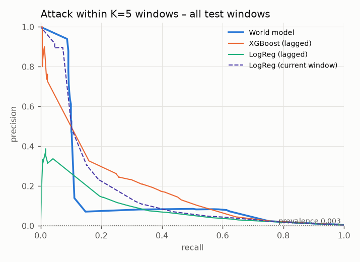
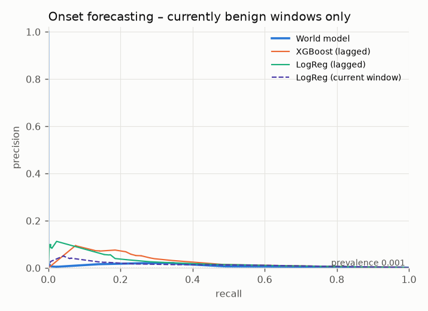
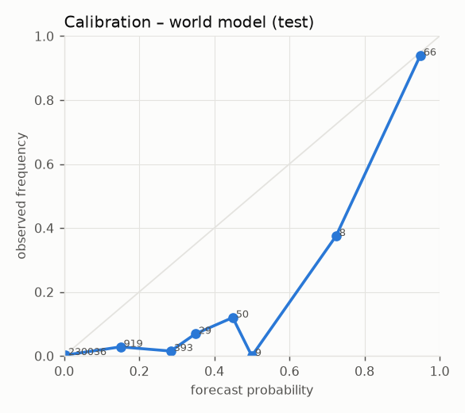
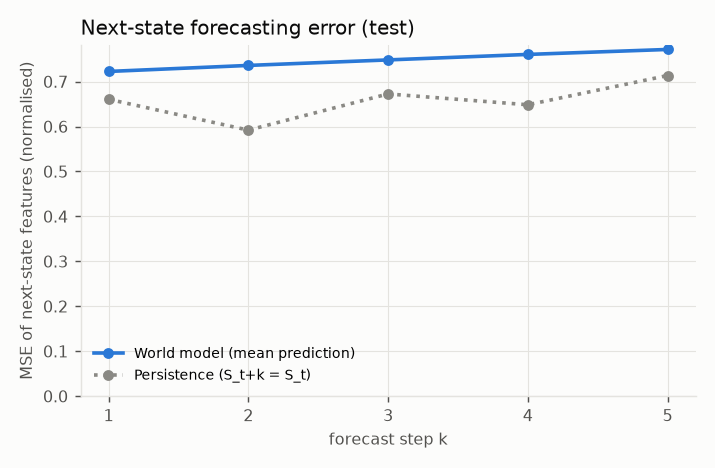
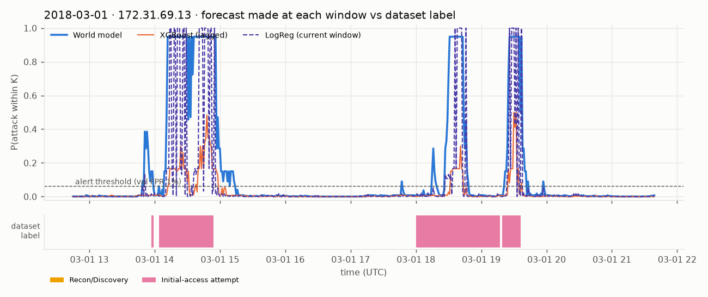
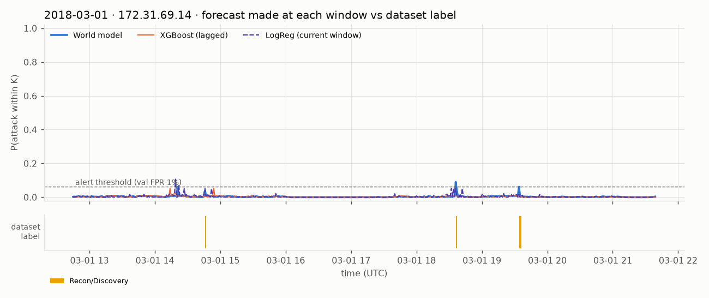
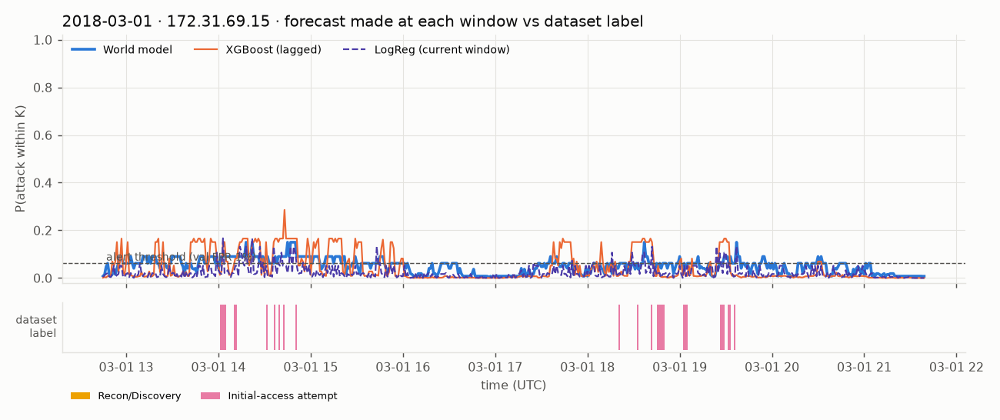
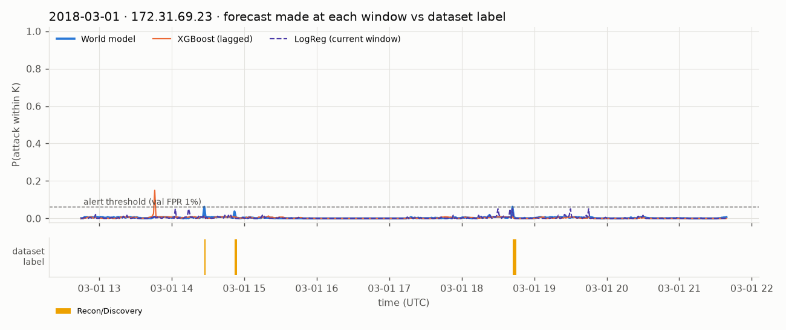
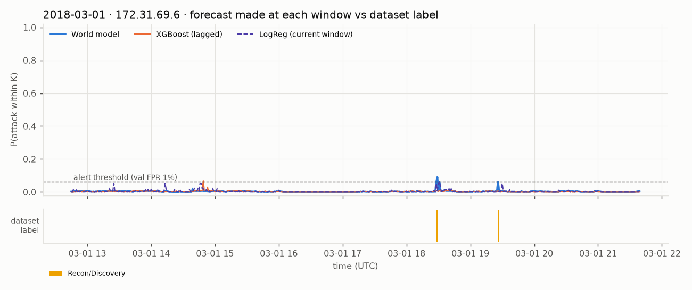
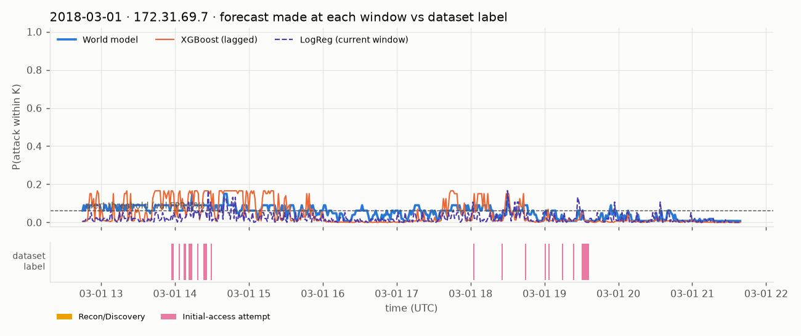
