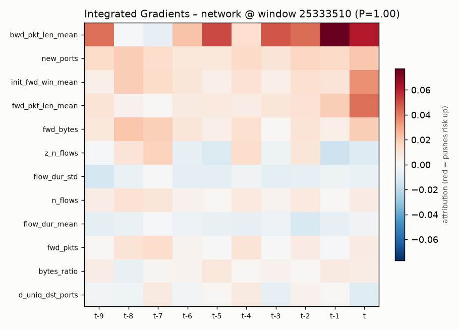
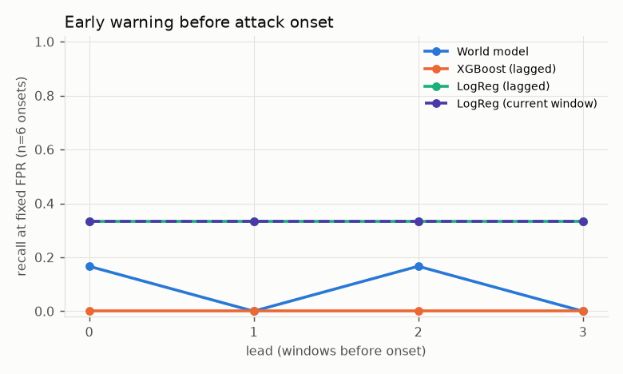
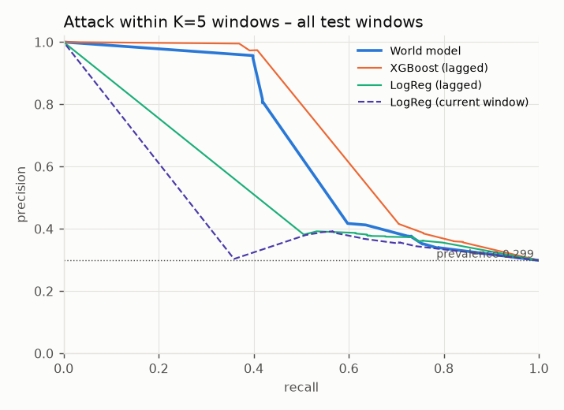
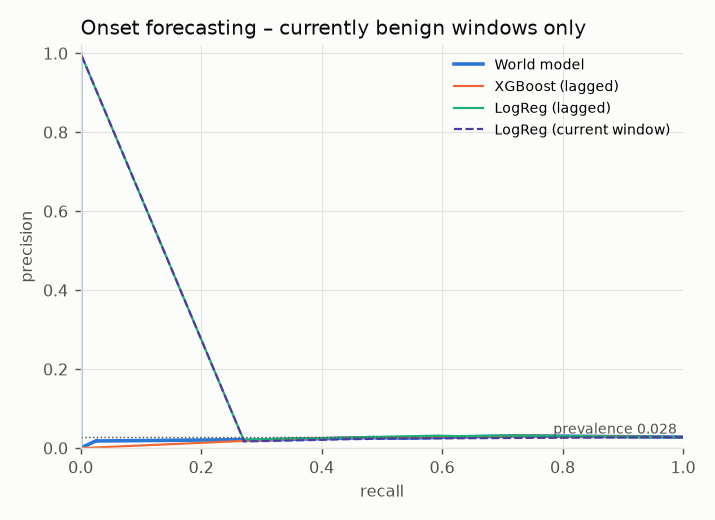
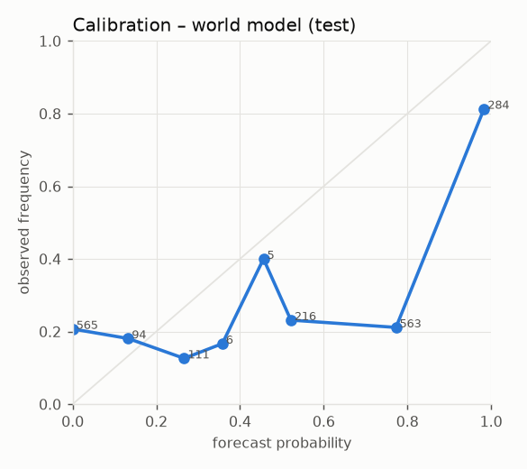
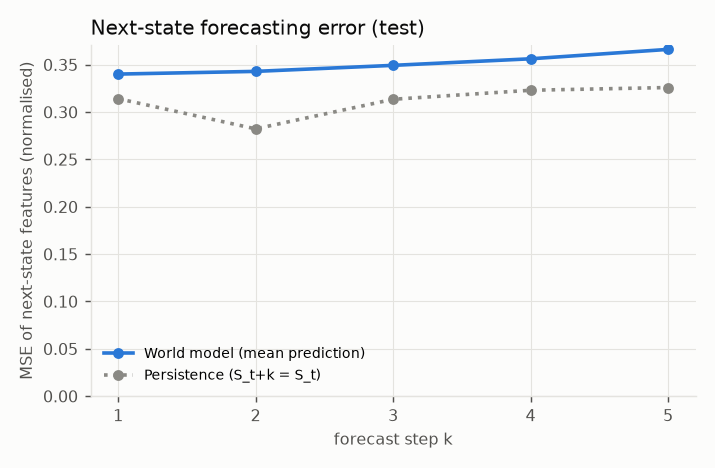
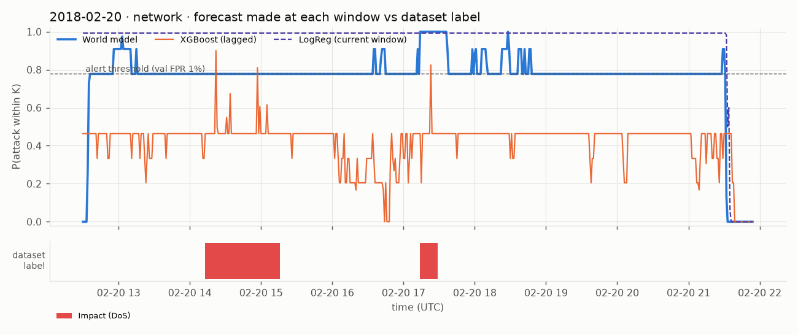
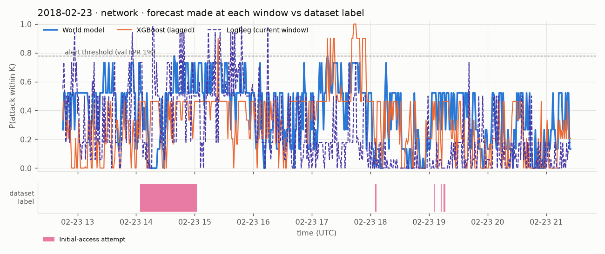
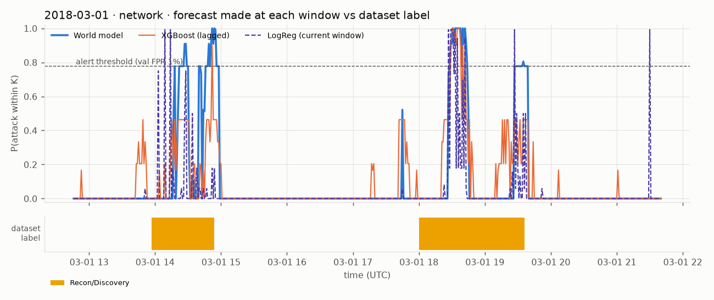
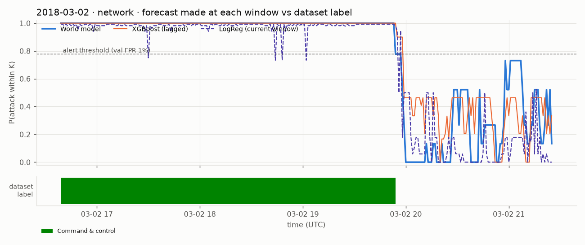

# Results – cic2018_network (Protocol A)

Generated by `scripts/evaluate.py` from `artifacts/cic2018_network/main`. All numbers are on the held-out **test** split; thresholds were chosen on validation (FPR 1% on quiet validation windows).

Test samples: 1848 (positives: 552); train 1617, val 414.

## Horizon forecast: P(attack within K windows)

| Model | Precision | Recall | F1 | FPR | ROC-AUC | PR-AUC (95% CI) | PR-AUC onset (95% CI) | PR-AUC ongoing | Brier | ECE |
|---|---|---|---|---|---|---|---|---|---|---|
| World model | 0.806 | 0.420 | 0.552 | 0.0432 | 0.696 | 0.608 [0.33, 0.80] | 0.026 [0.01, 0.06] | 0.988 | 0.284 | 0.308 |
| XGBoost (lagged) | 0.974 | 0.408 | 0.575 | 0.0046 | 0.732 | 0.627 [0.37, 0.80] | 0.027 [0.01, 0.05] | 0.988 | 0.173 | 0.153 |
| LogReg (lagged) | 0.382 | 0.505 | 0.435 | 0.3488 | 0.614 | 0.363 [0.19, 0.57] | 0.027 [0.01, 0.06] | 0.988 | 0.366 | 0.338 |
| LogReg (current window) | 0.303 | 0.359 | 0.329 | 0.3511 | 0.571 | 0.328 [0.18, 0.52] | 0.025 [0.01, 0.05] | 0.988 | 0.379 | 0.367 |
| Persistence (oracle label) | 0.986 | 0.891 | 0.936 | 0.0054 | 0.943 | 0.911 [0.81, 0.97] | 0.028 [0.01, 0.05] | 0.986 | 0.036 | 0.036 |

*Persistence uses the TRUE current label (an oracle detector) – it is a reference, not a deployable model.* *Onset = windows whose own label is benign; ongoing = windows already inside an attack.*

World model over 3 seeds: PR-AUC 0.564 ± 0.038, onset PR-AUC 0.027 ± 0.002, F1 0.540 ± 0.016, FPR 0.050 ± 0.031. Differences between ablations smaller than this seed spread are not meaningful.

## Early warning (recall at the validation threshold)

| Model | lead 0 (onset window) | T−1 | T−2 | T−3 | # onsets |
|---|---|---|---|---|---|
| World model | 0.17 | 0.00 | 0.17 | 0.00 | 6 |
| XGBoost (lagged) | 0.00 | 0.00 | 0.00 | 0.00 | 6 |
| LogReg (lagged) | 0.33 | 0.33 | 0.33 | 0.33 | 6 |
| LogReg (current window) | 0.33 | 0.33 | 0.33 | 0.33 | 6 |
| Persistence (oracle label) | 1.00 | 0.00 | 0.00 | 0.00 | 6 |

## Next-state forecasting (does the model learn dynamics?)

| step k | 1 | 2 | 3 | 4 | 5 |
|---|---|---|---|---|---|
| World model MSE | 0.340 | 0.343 | 0.349 | 0.356 | 0.366 |
| Persistence MSE | 0.314 | 0.282 | 0.313 | 0.323 | 0.326 |

## Future-stage macro-F1 per step (world model)

k=1: 0.400 | k=2: 0.416 | k=3: 0.430 | k=4: 0.445 | k=5: 0.441

## Explainability sanity check (deletion test)

Replacing the top-5 IG features by benign values lowers P(attack) by 0.803 on average vs 0.001 for 5 random features (n=40 highest-risk test forecasts).

## Ablations (world model only)

| Run | What changed | PR-AUC | PR-AUC onset | F1 | FPR | recall T−1 | recall T−2 | state MSE k=1 / k=5 |
|---|---|---|---|---|---|---|---|---|
| A1_no_dynamics_loss | dynamics loss weight 0 (a sequence classifier) | 0.639 | 0.029 | 0.564 | 0.0046 | 0.00 | 0.00 | 1.055 / 1.235 |
| A2_direct_heads | K direct heads on h_t instead of recursive rollout | 0.346 | 0.025 | 0.270 | 0.1867 | 0.17 | 0.17 | 0.382 / 0.396 |
| A3_L1 | history length 1 (no temporal context) | 0.393 | 0.025 | 0.163 | 0.0278 | 0.00 | 0.00 | 0.392 / 0.394 |
| A3_L20 | history length 20 | 0.545 | 0.025 | 0.517 | 0.0293 | 0.00 | 0.00 | 0.346 / 0.371 |
| A3_L5 | history length 5 | 0.436 | 0.027 | 0.471 | 0.1620 | 0.17 | 0.17 | 0.351 / 0.364 |
| A6_teacher_forcing_only | always teacher forcing (no scheduled sampling) | 0.367 | 0.026 | 0.458 | 0.3472 | 0.33 | 0.33 | 0.321 / 0.350 |
| A7_lstm | LSTM cell instead of GRU | 0.371 | 0.025 | 0.420 | 0.2855 | 0.17 | 0.17 | 0.355 / 0.384 |
| main | GRU world model, L=10, K=5, scheduled sampling (reference) | 0.608 | 0.026 | 0.552 | 0.0432 | 0.00 | 0.17 | 0.340 / 0.366 |
| protocolB | Protocol B: strict global chronology (unseen families in test) | 0.456 | 0.039 | 0.106 | 0.0103 | 0.14 | 0.00 | 0.474 / 0.516 |
| residual | residual dynamics (predict change of state) | 0.351 | 0.026 | 0.391 | 0.3457 | 0.33 | 0.33 | 0.300 / 0.402 |
| seed1 | same as main, seed 1 | 0.569 | 0.025 | 0.551 | 0.0162 | 0.00 | 0.00 | 0.352 / 0.380 |
| seed2 | same as main, seed 2 | 0.514 | 0.031 | 0.517 | 0.0918 | 0.17 | 0.17 | 0.352 / 0.371 |

## Figures

